<div align="center">

# 🎨 DSH Custom Theme

**Elevate DeepSeek Harness with Bespoke Visuals and Modern Interactive Experiences**

User CSS Themes · Multi-Zone Wallpaper Workbench · Cosmic Particle Reasoning Slider · Typography & Streaming Ink · Thought Disclosure Strategies

[](https://www.npmjs.com/package/dsh-custom-theme)
[](https://github.com/Sparrived/dsh-custom-theme/blob/main/LICENSE)
[](https://github.com/deepseek-ai/dsh)
[](https://github.com/Sparrived/dsh-custom-theme)
[](https://github.com/Sparrived/dsh-custom-theme/pulls)

**English** | [简体中文](README.md)

</div>

---

## 🌟 Overview

DeepSeek Harness natively provides only three fixed appearances: Light, Dark, and System, without an extensible user-facing styling system. **dsh-custom-theme** brings comprehensive visual personalization, ergonomic typography, and dynamic interactive enhancements to both the DSH Desktop application and the Web GUI:

- 🎨 **User-Editable CSS Theme Directory**: Drop any `.css` stylesheet into the theme folder for instant hot-reloading; includes bundled **Atom One Dark**, **Monokai Pro**, and **Gov** palettes.
- 🖼️ **Multi-Zone Wallpaper Workbench**: Segment the window into 6 distinct interactive visual regions (Global Viewport, Window Bar, Sidebar, Conversation Stream, Composer Seat, Dock Panel) with independent image, cover/contain sizing, positioning, opacity, and Gaussian blur controls.
- 🌌 **Cosmic Starfield & Deep-Sea Reasoning Slider**: Replaces plain model menu rows with an interactive particle physics slider featuring **Codex Starfield** (22 phase-decorrelated drifting stars, dynamic nebula ramp, energy glow) and **DeepSeek Abyssal Whale** visual themes.
- ✍️ **Typography & Font Customization**: Quick-select capsules for font sizes (12px–17px) and line-height spacing offsets (-2px–+6px), plus custom font family selection for conversation prose and code blocks.
- 🌊 **Typewriter Streaming Fade-In & Ink Drop**: Smoothly fades in streaming text output to eliminate abrupt token jumpiness, with customizable fade duration and initial ink opacity.
- 💬 **Working Status Phrases & Shimmer Effects**: Rotate custom thinking phrases (e.g., "Deep-diving...", "Roaming the stars...", "Pondering...") with adjustable intervals; choose from Official sweep, Matte shimmer, Rainbow spectrum, Static, or Hidden modes.
- 🧠 **Automatic Reasoning Level Patching for 3rd-Party Models**: Automatically equips custom/third-party models in `cordis.patch.yml` that declare no effort levels with `off / low / high / max` controls, complete with byte-for-byte backup and rollback safety.
- 🔍 **Context Injections & Auto-Expand Modes**: Restores visibility for folded prompt/rule/skill injections; offers smart reasoning disclosure modes (`streaming`, `keep`, `always`, `off`).
- ⚡ **Zero External Dependencies · Ultra-Lightweight**: Built entirely with native platform APIs, backed by 190+ automated unit and Chromium CDP browser smoke tests for jitter-free rendering.

---

## 📸 Visual Showcase & Features

### 1. Modernized Settings Panel & Theme Engine

In **Settings → Theme & Background (主题与背景)**, an intuitive card-based layout lets you manage color schemes, custom CSS palettes, and appearance options with zero configuration hassle.

<div align="center">
  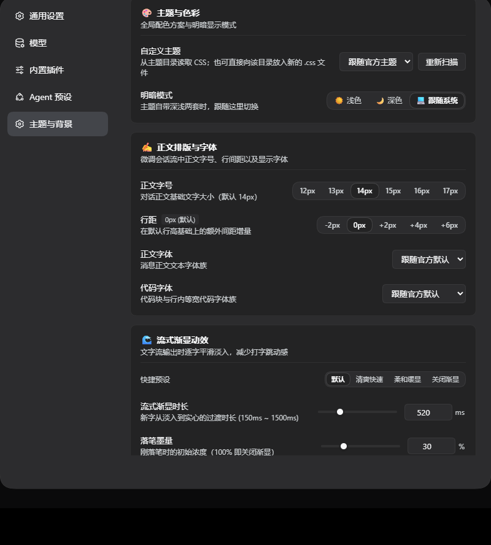
</div>

#### Bundled Themes in Action

<table>
  <tr>
    <td align="center" width="50%">
      <b>Atom One Dark</b><br />
      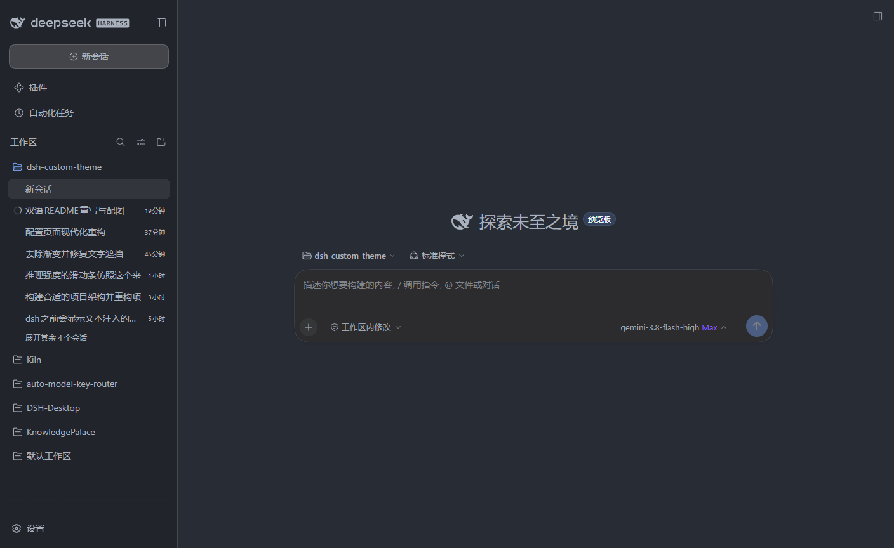
    </td>
    <td align="center" width="50%">
      <b>Monokai Pro</b><br />
      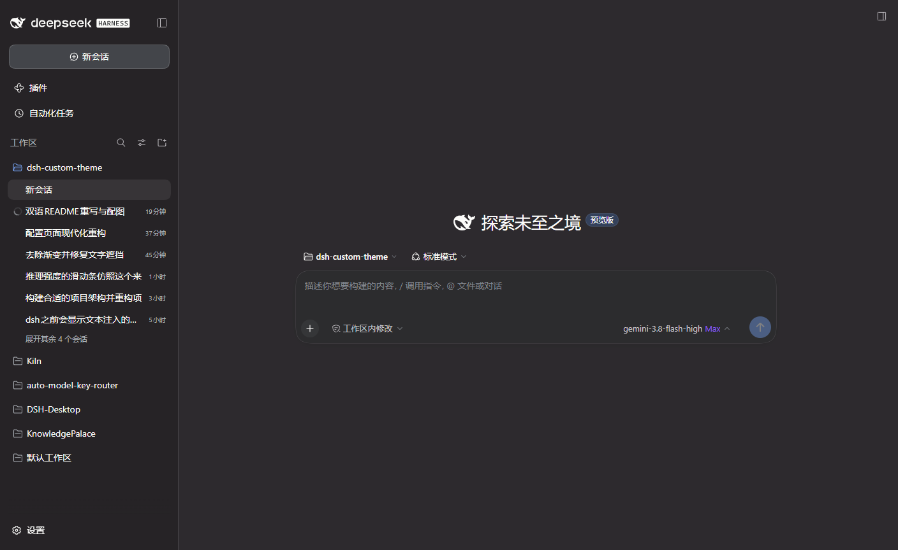
    </td>
  </tr>
  <tr>
    <td align="center" colspan="2">
      <b>Gov Terminal Dark</b><br />
      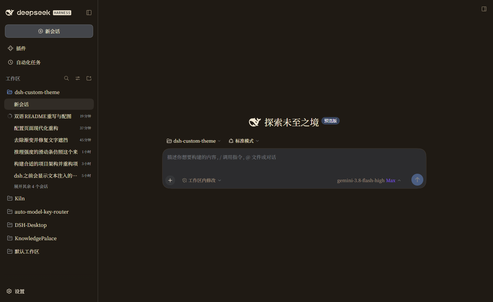
    </td>
  </tr>
</table>

---

### 2. Multi-Zone Wallpaper Workbench

The interface is deconstructed into 6 dedicated zones. You can paint a panoramic background across the entire window or configure bespoke wallpapers and frosted glass effects for individual panels.

<div align="center">
  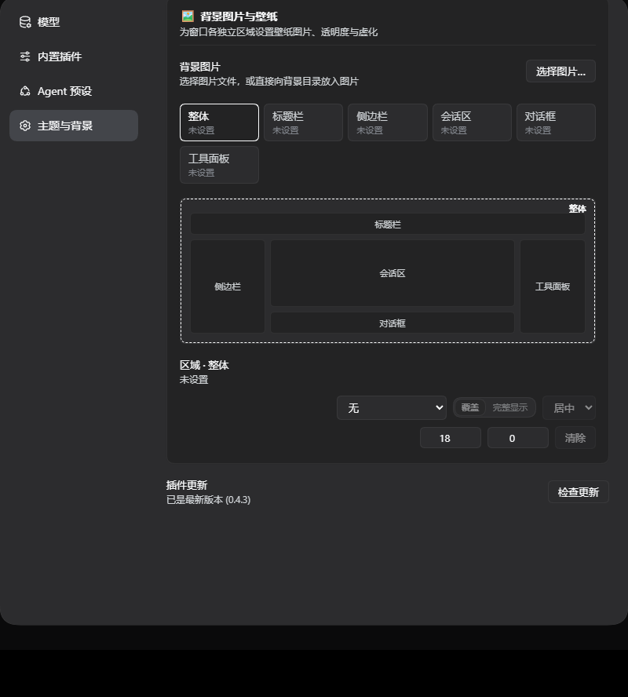
  <p><i>Click any region in the interactive window wireframe to adjust wallpaper image, opacity (0%–100%), and blur (0px–20px)</i></p>
</div>

#### Multi-Zone Real-World Rendering

Wallpapers are rendered exclusively through isolated `::before` pseudo-element layers, decoupled from the DOM layout flow. **Text contrast remains crystal-clear, and message streaming never incurs unnecessary repaints**:

<div align="center">
  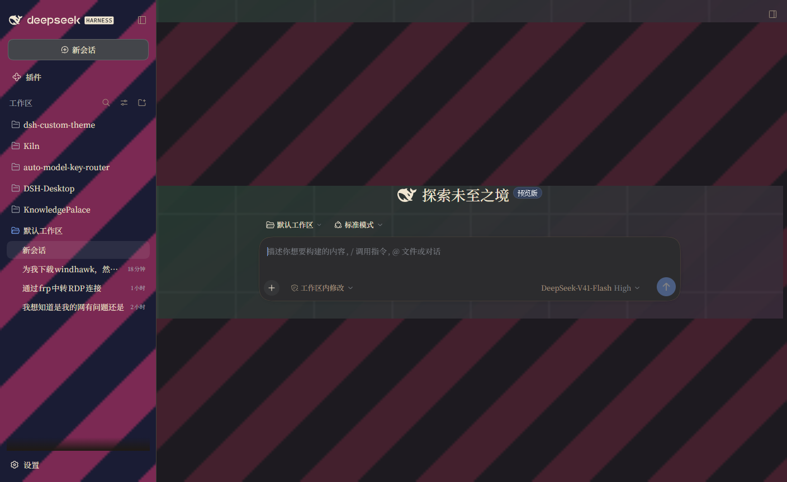
</div>

---

### 3. Cosmic Starfield & Deep-Sea Reasoning Slider

In the model selector menu, the default static effort row is upgraded to an interactive, animated particle physics slider.

<div align="center">
  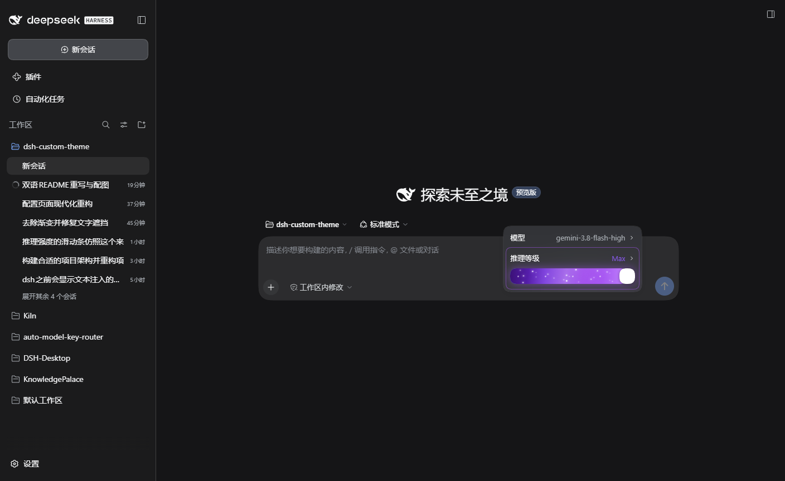
</div>

<div align="center">
  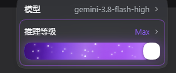
  <p><i>Codex Starfield: 22 phase-decorrelated drifting particles, nebula gradient fill, and dynamic energy ambience</i></p>
</div>

- **Dual Aesthetic Themes**: Switch between **Codex Starfield** (cosmic nebula & stars) and **DeepSeek Abyssal** (deep-sea cyan glow with a swimming whale track).
- **Silky Interactions**: Smooth continuous drag, magnetic tick-snapping, and full keyboard navigation (`Arrow keys` for steps, `Home`/`End` to jump).
- **Universal Sync**: Maps transparently across `off`, `low`, `high`, and `max`, directly updating the underlying model execution context.

---

### 4. Working Status Phrases & Shimmer Effects

When the AI model enters deep thought or runs tools, the working label transforms into a delightful, expressive display.

<div align="center">
  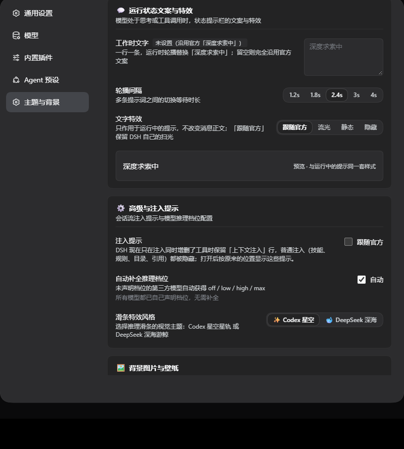
</div>

- **Phrases Rotation**: Provide multiple custom lines, automatically rotating at your chosen interval (1.2s to 4s).
- **Visual Effects**:

| Effect Mode | Visual Appearance | Description |
| :--- | :--- | :--- |
| **Official** | Default blue-white sweep | Preserves DSH's clean standard sweep animation |
| **Matte Shimmer** | Solid text color with tinted band | 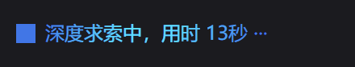 Elegant and subtle |
| **Rainbow Spectrum** | Continuous chromatic wave | 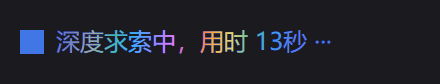 Vibrant and luminous |
| **Static** | Solid steady color, no animation | Distraction-free, zero animation overhead |
| **Hidden** | Collapsed bar | Completely hides visual bar while preserving screen reader accessibility |

---

### 5. Advanced Enhancements

| Feature | Details |
| :--- | :--- |
| **✍️ Typography & Line Spacing** | Instant size capsule buttons (12px–17px), fine-grained line height adjustments (-2px–+6px), and custom body & code font families. |
| **🌊 Streaming Fade-In** | Eliminates harsh jumping when new tokens arrive. Includes presets like *Fast*, *Soft*, and *Default* with adjustable transition time and ink opacity. |
| **🧠 Effort Level Auto-Patching** | Detects 3rd-party models in `cordis.patch.yml` that lack reasoning effort configurations and automatically supplies full `off/low/high/max` controls. |
| **🔍 Injected Context Restoral** | Restores visibility for folded Agent skills, workspace guidelines, and system injections into clean collapsible cards. |
| **📖 Reasoning Disclosure Modes** | Select from `streaming` (auto-expand during generation, auto-collapse upon finish), `keep` (stay expanded), `always`, or `off`. |
| **🔄 Seamless In-App Updates** | Background update checks against npm registries with a one-click upgrade button right inside Settings. |

---

## 📦 Installation & Setup

### Requirements

- **DeepSeek Harness** `0.2.0` or later.
- Compatible with **DSH Desktop** and **DSH Web GUI**.

### Method 1: Via DSH Plugin Manager (Recommended)

1. Launch DeepSeek Harness, and click **Plugins (插件)** in the left sidebar.
2. Search for `dsh-custom-theme` and click **Install**.
3. Restart DSH once; the **Theme & Background** section will appear in **Settings**.

### Method 2: Manual Configuration (`cordis.patch.yml`)

1. Install the package in your active DSH profile directory:
   ```bash
   pnpm add dsh-custom-theme
   ```

2. Register the plugin in `cordis.patch.yml`:
   ```yaml
   dsh-custom-theme:
     themesDir: ~/.dsh/themes
     backgroundsDir: ~/.dsh/backgrounds
   ```

3. Restart DSH Desktop or your `dsh web` service.

---

## 🎨 Authoring Custom CSS Themes

Creating a new theme is as simple as **dropping a `.css` file into the theme directory!**

### Directory Locations

- **Windows**: `C:\Users\<Username>\.dsh\themes\<theme-id>.css`
- **macOS / Linux**: `~/.dsh/themes/<theme-id>.css`

### Theme CSS Template

Simply override the `--dsw-alias-*` custom properties. The plugin extracts the palette and injects it into DSH's native theme runtime, automatically synthesizing matching Shiki syntax-highlighting tokens:

```css
/* ~/.dsh/themes/dracula-pro.css */

/* 1. Light / Default Palette */
:root {
  --dsw-alias-bg-base: #f8f8f2;
  --dsw-alias-bg-subtle: #eaeaea;
  --dsw-alias-brand-primary: #6272a4;
  --dsw-alias-label-primary: #282a36;
  --dsw-alias-label-secondary: #44475a;
  --dsw-alias-border-base: #d1d5db;
}

/* 2. Dark Palette (activates when switching to Dark mode) */
[data-theme="dark"] {
  --dsw-alias-bg-base: #282a36;
  --dsw-alias-bg-subtle: #1e1f29;
  --dsw-alias-brand-primary: #bd93f9;
  --dsw-alias-label-primary: #f8f8f2;
  --dsw-alias-label-secondary: #6272a4;
  --dsw-alias-border-base: #44475a;
}
```

After saving your file, open **Settings → Theme & Background** and click **Rescan (重新扫描)**. Your new theme will appear immediately!

<details>
<summary><b>🔍 Core CSS Custom Property Reference</b></summary>

| Property | Description |
| :--- | :--- |
| `--dsw-alias-bg-base` | Primary window and application background |
| `--dsw-alias-bg-subtle` | Secondary surface background (cards, sidebar, composer) |
| `--dsw-alias-brand-primary` | Main brand accent color (buttons, active states, focus rings) |
| `--dsw-alias-brand-hover` | Brand accent hover color |
| `--dsw-alias-label-primary` | Primary body text color |
| `--dsw-alias-label-secondary` | Secondary and descriptive label color |
| `--dsw-alias-border-base` | General container borders and dividers |
| `--dsw-alias-label-deep-diving` | Working label text color (e.g. "Deep-diving...") |
| `--dsw-alias-label-shimmer` | Shimmer sweep highlight color |

</details>

---

## 🏛️ Architecture

`dsh-custom-theme` employs a decoupled two-tier architecture designed for maximum performance:

```
dsh-custom-theme/
├── src/
│   ├── index.mjs                # Host entry: Cordis row, serves /dsh-custom-theme/* routes
│   ├── host/                    # Host implementations (fs storage, AST patcher, updates)
│   ├── themes.mjs               # Pure theme rules (sanitization, MIME sniffing, bounds)
│   ├── effort-levels.mjs        # AST & text surgery on cordis.patch.yml
│   ├── update.mjs               # npm Registry client and cache manager
│   └── client/                  # Browser frontend source (modular CommonJS components)
├── lib/
│   └── client.js                # Bundled frontend module (lazy-loaded by DSH Web GUI)
├── themes/                      # Seeded stylesheets (one-dark, monokai-pro, gov)
└── test/                        # Complete test suite: Unit tests + Real Chromium CDP browser tests
```

- **Strict Tier Isolation**: The Host half imports only `node:` builtins; the Browser half uses the shell's built-in React runtime without introducing external dependencies.
- **Zero Paint Penalty**: Wallpapers run inside isolated pseudo-element stacking contexts with `requestAnimationFrame` batching, maintaining steady 60fps scrolling and streaming.

---

## 🧪 Testing & Verification

Every feature is rigorously verified through an automated test suite containing over 190 tests:

```bash
# Run all unit tests and architectural boundary checks
pnpm test

# Run real-browser smoke tests (appearance, repaints, wallpaper persistence)
pnpm run test:browser

# Verify working label shimmer effects in Chromium
pnpm run test:effects
```

---

## 📄 License

This project is licensed under the [MIT License](LICENSE).

Feel free to open an [Issue](https://github.com/Sparrived/dsh-custom-theme/issues) or submit a [Pull Request](https://github.com/Sparrived/dsh-custom-theme/pulls) to contribute new themes and enhancements!
